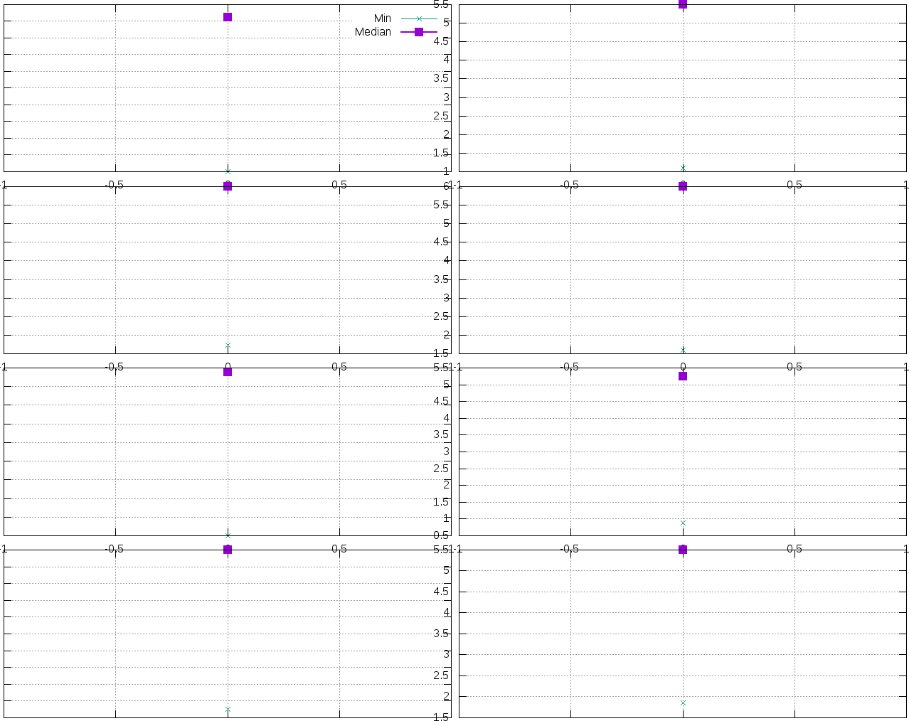
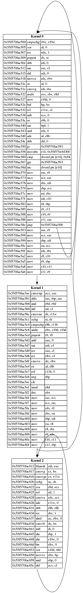

# @title Visualization
# Visualization

*Evoasm* provides means to visualize loss functions and found programs.

{include:file:docs/examples/vis.rb}

## Loss Functions

Loss functions can be visualized by using {Evoasm::Population#plot} which
will plot the loss function using [Gnuplot](https://gnuplot.sourceforge.net/).
If a filename is provided, the loss function graph is saved to file. Otherwise,
a window will open.

Each column represents a deme. The first row shows program losses, the following
rows kernel losses.

## Programs

In a similar fashion, programs can be visualized using [Graphviz](https://www.graphviz.org/).
Use {Evoasm::Program#to_gv} to obtain a [GV::Graph](http://www.rubydoc.info/github/furunkel/gv/GV/Graph), which
can be saved to a file using [GV::Graph#save](http://www.rubydoc.info/github/furunkel/gv/GV/Graph#save-instance_method).

